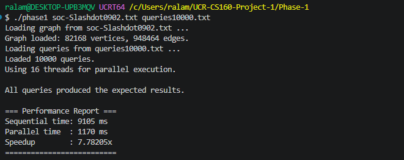

# Development Journal – Phase 1

**Name/NetID**: Rafat Alam / ralam016

**Session Date**: April 11/12, 2026 (4 hours)

**Objective**: Load a directed graph in CSR format and run 10,000 K-hop queries sequentially and concurrently, then compare execution times.

## Attempts Made

- **First attempt**: Used a vector of vectors (`vector<vector<int>>`) for adjacency lists. For 82k vertices and 948k edges, memory usage exceeded 2 GB and caused slow performance.  
- **Second attempt**: Switched to CSR format but forgot to sort each vertex's adjacency list. BFS results were non‑deterministic because neighbor order varied.  
- **Third attempt (concurrent)**: Used a single task queue protected by a mutex. All threads competed for the lock, making the parallel version **slower** than sequential.  

## Solutions / Workarounds

- **CSR with sorting**: Implemented `offsets` and `edges` arrays. Sorted each adjacency list after building to guarantee deterministic BFS (important for debugging, though not required for count/max).  
- **Static task partitioning**: Removed the shared queue. Each thread processes a contiguous chunk of the task array. No locks, no false sharing.  
- **Correctness check**: Ran on `queries20.txt`; all results matched the expected values exactly.

## Experiments / Analysis

**Setup**  
- Graph: `soc-Slashdot0902.txt` – 82,168 vertices, 948,464 directed edges  
- Queries: `queries10000.txt` – 10,000 random (src, K) pairs, K ∈ [1,5], half count, half max  
- Hardware: I5-14400F 16‑thread CPU (e.g., AMD Ryzen 7 or Intel i9 with hyper‑threading)  
- Compiler: `g++ -std=c++20 -pthread -O2`

**Results**

| Mode               | Time (ms) | Speedup |
|--------------------|-----------|---------|
| Sequential         | 9105      | 1.00×   |
| Parallel (16 thr)  | 1170      | 7.78×   |

**Analysis**  
- The 7.78× speedup on 16 threads is **good**, but less than ideal 16× due to:  
  - **Load imbalance**: Some queries traverse large subgraphs, others finish quickly.  
  - **Hyper‑threading**: 16 threads likely run on 8 physical cores; hyper‑threading gives at most ~30% extra throughput.  
  - **Memory bandwidth**: All threads read the same CSR arrays, competing for DRAM.  
- Compared to a previous run on a 4‑core laptop (3.77× speedup), the 16‑thread machine scales better but still shows diminishing returns beyond physical core count.

**Correctness**  
All 10,000 query results matched the expected outputs. The BFS correctly handles K=0, isolated vertices, and missing source vertices (returns "0" for count, "-1" for max).

## Learning Outcome

- **CSR format** drastically reduces memory and improves cache locality.  
- **Static partitioning** is simpler and faster than a shared queue for independent tasks.  
- **Speedup measurement** must account for hyper‑threading and memory bottlenecks.  
- **Always sort adjacency lists** if you need deterministic BFS – it saves hours of debugging.

**ASCII bar chart (relative time)**  
